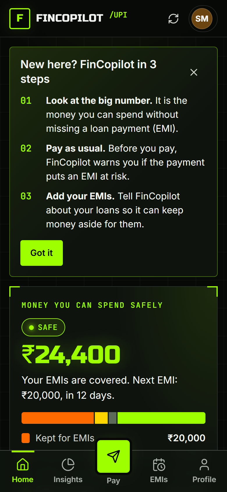
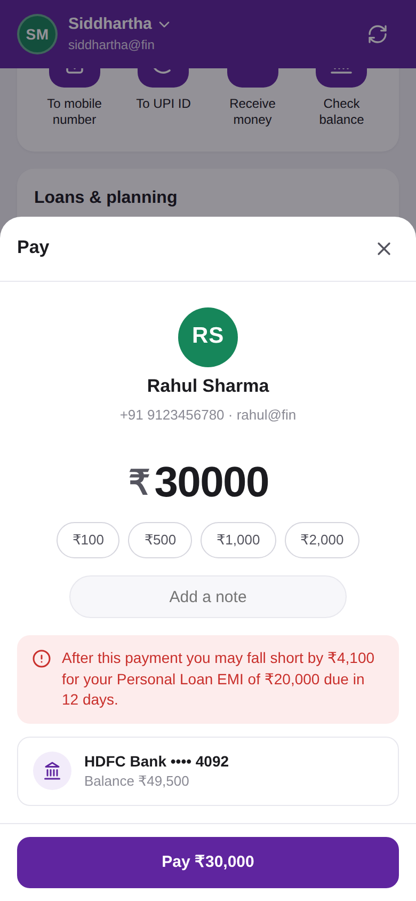
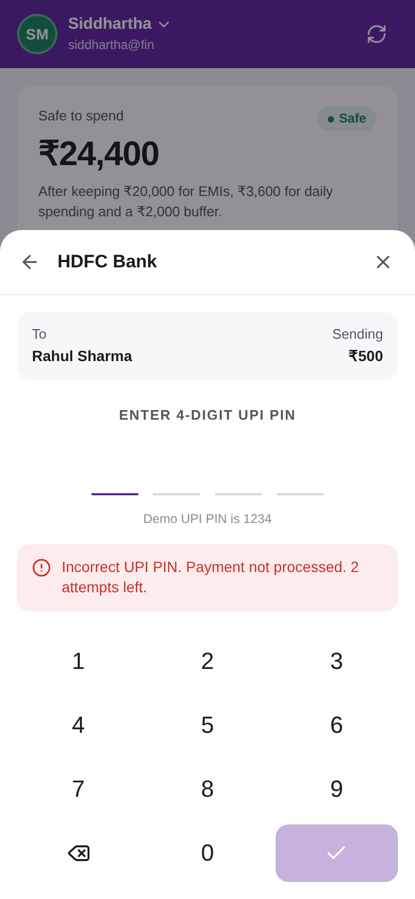
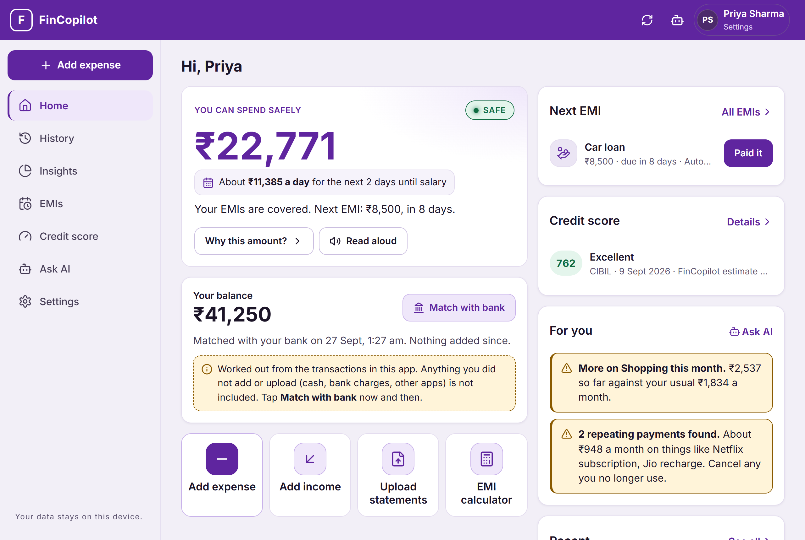

# FinCopilot

UPI payments that tell you how much is **safe to spend** before your EMIs are due.

FinCopilot is a demo payments app for Indian UPI users. It works like a regular UPI app (pay to a mobile number or UPI ID, check balance with your UPI PIN, receive money, view history), and adds one thing: before you pay, it checks whether the payment would leave you short for an upcoming loan EMI.

- **Live app:** https://fincopilot-upi.vercel.app
- **API health:** https://fincopilot-upi.vercel.app/api/health

> All accounts, banks and payments are simulated. No real money moves. Demo UPI PIN: `1234`.

| Home (mobile) | Pay, with EMI warning | UPI PIN |
|---|---|---|
|  |  |  |



## Features

- **Two demo accounts** (Siddhartha ₹50,000 and Rahul ₹30,000). Paying one from the other debits and credits both.
- **Pay** to a 10-digit mobile number, a UPI ID or a saved contact, with a 4-digit UPI PIN on a UPI-style keypad.
- **PIN protection**: 3 wrong attempts lock the PIN for 5 minutes (real UPI apps lock for 24 hours).
- **Check balance** with your PIN. This also sets the "verified" balance that later payments are tracked from.
- **Safe to spend** = balance − EMIs due − expected daily spending until the next EMI − ₹2,000 buffer.
- **Warning before paying** if the amount would put an EMI at risk.
- **EMIs**: add, pay, remove; due-date countdown; a paid EMI becomes due again next cycle.
- **Insights**: the safe-to-spend calculation step by step, a "can I afford it?" simulator, next-7-days balance, spending by category, and 30/60/90-day outlook.
- **History**: search, filter by type and category, edit a transaction's category, download a CSV statement.
- **Profile**: switch demo account, change UPI PIN, reset demo data.

## Project structure

```
backend/                 Express API
  src/server.js          App setup, routes, DB connection middleware
  src/config/            MongoDB connection, JSON file store, categories
  src/controllers/       account, transaction, EMI handlers
  src/services/          dataService (storage + PIN + transfers), financialEngine (safe-to-spend), seed data
  src/models/            Mongoose schemas
  tests/api.test.js      End-to-end API tests (node:test)
frontend/                React + Vite
  src/App.jsx            App shell: top bar, sidebar / bottom nav, sheets
  src/pages/             Home, Insights, EMIs, History, Profile
  src/flows/             Pay, check balance, change PIN, receive, EMI and transaction sheets
  src/components/        Transaction row and UI primitives (Sheet, PinPad, Avatar, ...)
  src/lib/               Formatting and the "what if I spend" calculation
api/index.js             Serverless entry that wraps the Express app
vercel.json              Vercel services + rewrites (/api → backend, rest → frontend)
```

## Run locally

Requires Node.js 18+ (tested on 22).

```bash
npm install                      # root (concurrently)
cd backend && npm install && cd ..
cd frontend && npm install && cd ..
npm run dev                      # backend on :5000, frontend on :5173
```

Open http://localhost:5173. The backend seeds the two demo accounts on first start.

Data is stored in `backend/data/db.json` unless `MONGODB_URI` is set (see `.env.example`), in which case MongoDB is used. On Vercel without `MONGODB_URI`, data lives in `/tmp` and resets when the function instance is recycled.

## Browser-only demo

`cd frontend && npm run build:demo` builds `frontend/dist-demo/fincopilot-demo.html`, a single page that runs without a server. API calls are answered inside the page by `src/services/browserApi.js`, which reuses the backend's financial engine, categories and seed data. State is kept in the browser's localStorage, and the demo uses placeholder bank names.

To check that it behaves like the real server, run the backend tests against it:

```bash
cd frontend && node scripts/serve-browser-api.mjs 5055 &
cd backend && API_URL=http://127.0.0.1:5055/api npm test
```

## Tests

```bash
cd backend && npm test           # 13 API tests, uses a temporary data directory
cd frontend && npm run build     # production build
```

## API

| Method | Path | Purpose |
|---|---|---|
| GET | `/api/health` | Health check |
| GET | `/api/account/all` | Demo accounts for the switcher |
| GET | `/api/account/dashboard?userId=` | Balances, safe-to-spend, EMIs, insights, recent transactions |
| POST | `/api/account/check-balance` | `{ userId, upiPin }` verify balance |
| POST | `/api/account/update-pin` | `{ userId, oldPin, newPin }` |
| POST | `/api/account/reset` | Restore demo data |
| GET | `/api/transactions?userId=&type=&category=&search=&limit=` | History |
| POST | `/api/transactions/payment` | `{ senderId, recipientPhone \| recipientUpi \| recipientName, amount, upiPin, note }` |
| POST | `/api/transactions/receive` | `{ userId, senderName, amount, category, note }` simulate a credit |
| PATCH | `/api/transactions/:id/category` | `{ category }` |
| GET / POST | `/api/emi` | List / add EMIs |
| POST | `/api/emi/:id/pay` | `{ userId }` pay an EMI |
| DELETE | `/api/emi/:id?userId=` | Remove an EMI |

## Docs

- [AUDIT_REPORT.md](AUDIT_REPORT.md): full audit of the project, what was broken and what was fixed
- [UPGRADES.md](UPGRADES.md): recommended upgrades, compared with PhonePe, Google Pay, Paytm, CRED and others
- [docs/DATABASE_BACKUP_AND_RECOVERY.md](docs/DATABASE_BACKUP_AND_RECOVERY.md): backups (`cd backend && npm run backup`)
