# FinCopilot

**Know what you can spend before you spend it.**

FinCopilot is an expense and EMI manager for people in India. Upload your PhonePe, Google Pay, Paytm or bank statements (or add expenses by hand), add your loans, and it tells you one simple thing: **how much you can spend without missing an EMI**. It warns you when you are overspending, reminds you before EMIs are due, and has an AI assistant that runs on your own device.

It is built to be easy for everyone, from a 20-year-old student to a 60-year-old first-time smartphone user: one big number, plain words, big buttons, a text-size setting, six colour themes and a "Read aloud" button.

> FinCopilot does not move money and is not a bank. It reads what you give it and helps you decide.

- **Live app:** https://fincopilot-jaya-siddharthas-projects.vercel.app
- **Test report (simple English):** [TEST_REPORT.md](TEST_REPORT.md) · **What changed:** [CHANGES.md](CHANGES.md) · **Audit:** [AUDIT_REPORT.md](AUDIT_REPORT.md)

| Home | Upload up to 5 statements | Your safety buffer |
|---|---|---|
|  | 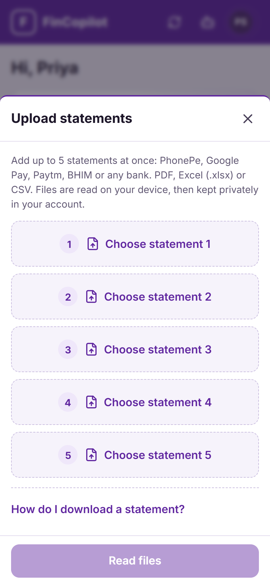 | 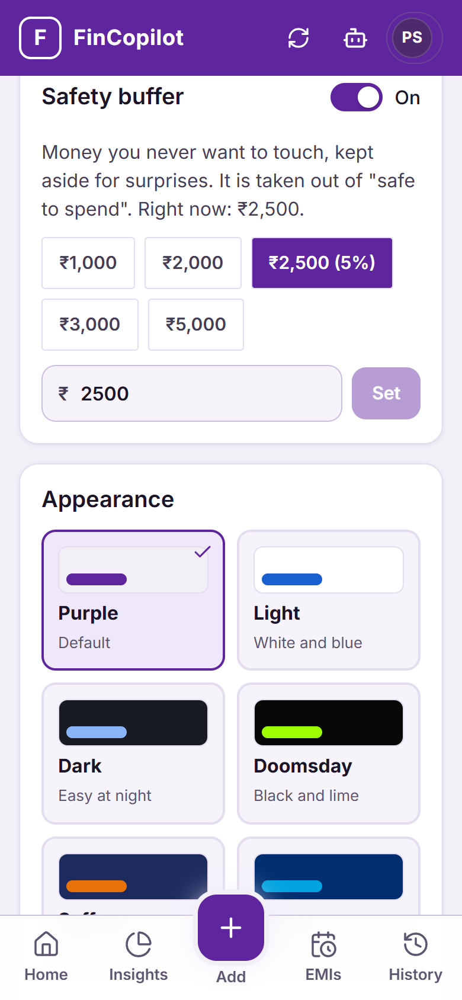 |

| EMI calculator | Credit health estimate | Ask the assistant |
|---|---|---|
| 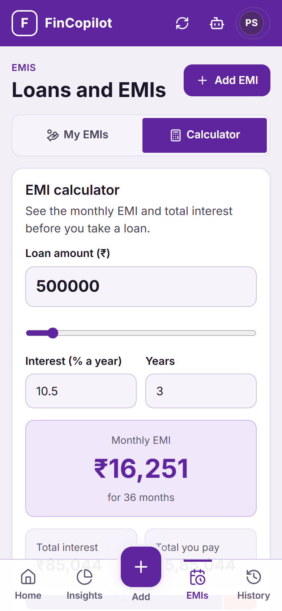 | 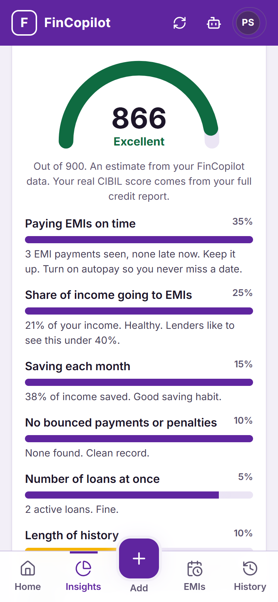 | 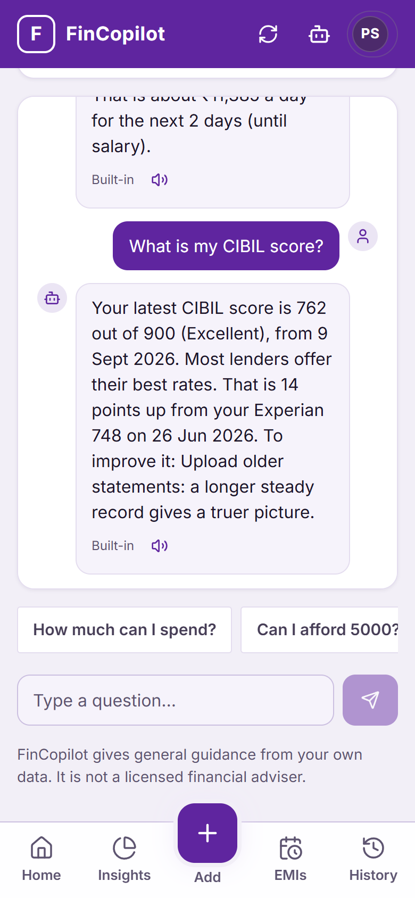 |

| Doomsday | Dark | Saffron | Ocean | Light |
|---|---|---|---|---|
| 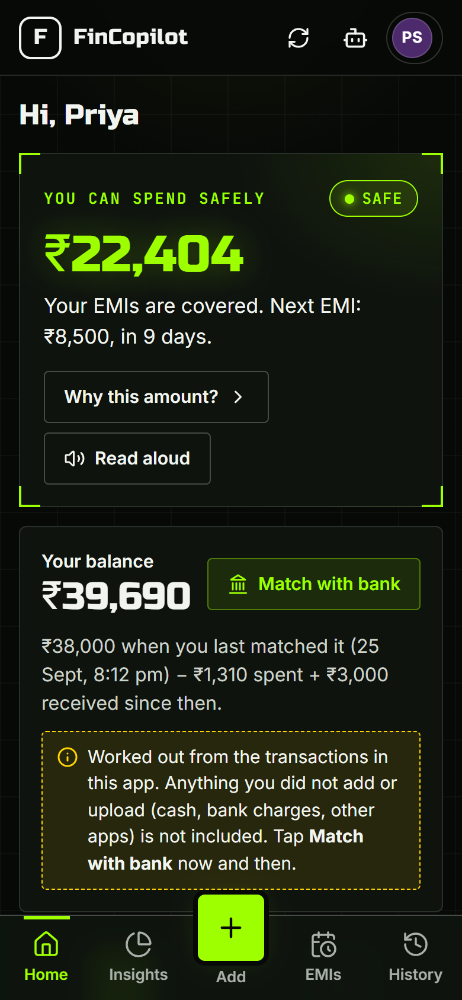 | 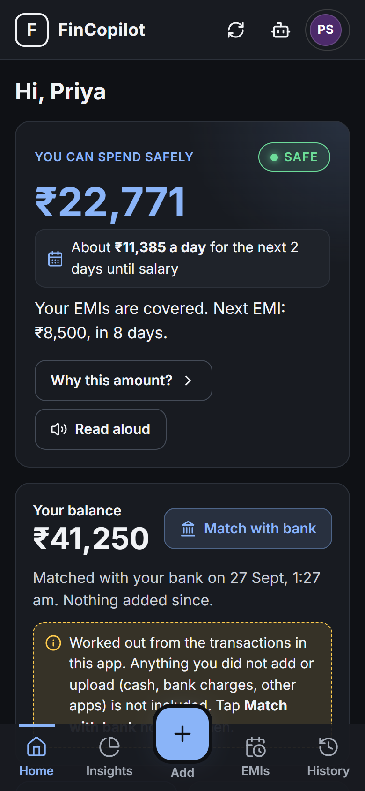 | 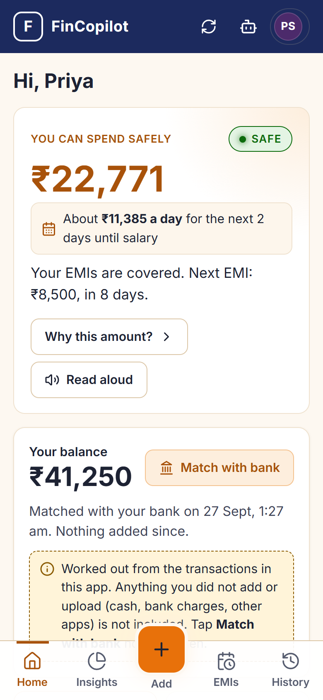 | 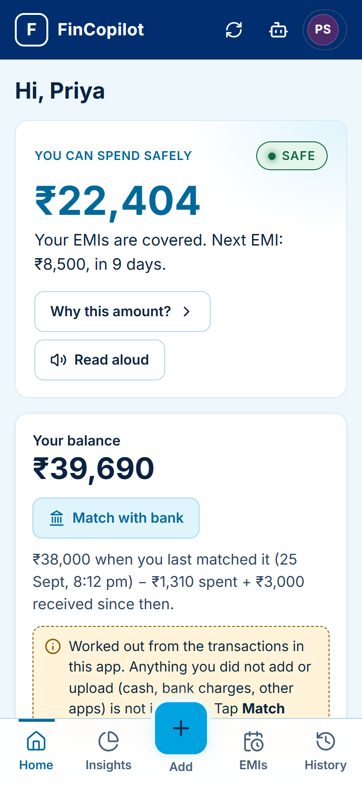 | 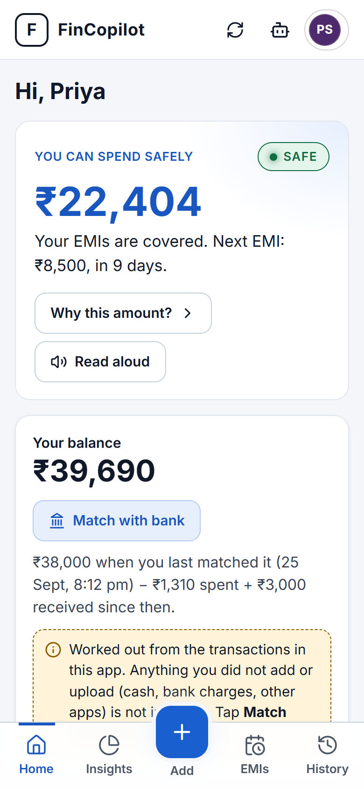 |

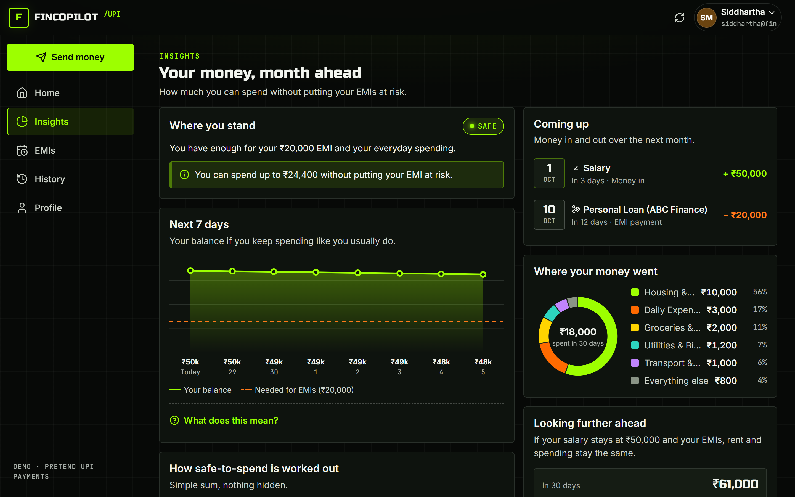

---

## Contents

1. [What it does](#what-it-does)
2. [How "safe to spend" works](#how-safe-to-spend-works)
3. [The offline AI](#the-offline-ai)
4. [Credit health estimate](#credit-health-estimate)
5. [Tech and architecture](#tech-and-architecture)
6. [Run it locally](#run-it-locally)
7. [Your data](#your-data)
8. [Tests](#tests)
9. [Deployment](#deployment)
10. [Project structure](#project-structure)
11. [Research behind the design](#research-behind-the-design)

---

## What it does

| Feature | What you get |
|---|---|
| **No sign-up** | Open the app and start. No login, no password, no account. |
| **Simple setup** | Name, income and salary day → your bank balance → your safety buffer → your theme. Four short steps. |
| **Home** | One big "You can spend safely" figure, your balance and how it was worked out, four big buttons, your next EMI, tips and recent transactions. |
| **Upload statements** | Up to **5 files at once**: PhonePe, Google Pay, Paytm, BHIM or any bank, as **PDF (including password-locked), Excel (.xlsx) or CSV**. Files are read on your device. A preview lets you **tick or untick every transaction** and change its category. Duplicates (the same payment in two statements, or already saved) are found and unticked for you. |
| **Add by hand** | Money out or money in, with the category picked automatically from the description. |
| **Balance** | Worked out from your transactions: the last figure you confirmed with your bank, plus money in, minus money out. **Match with bank** resets it and tells you if something happened outside the app (cash, bank charges, other apps). |
| **Safety buffer (your choice)** | In Settings: switch it on or off, and pick ₹1,000 / ₹2,000 / ₹3,000 / ₹5,000 / 5% of income, or type any amount. |
| **EMIs** | Add loans, see what is due and what is late, mark as paid, **autopay** (records the EMI as paid automatically on its due date), months left and % repaid, and how much of your income goes to EMIs. |
| **EMI calculator** | Monthly EMI, total interest, a year-by-year schedule, whether it fits your income, and "Add as EMI". |
| **Stop overspending** | Spending-pace alert ("faster than usual this month"), category spikes, repeating payments (subscriptions), a 7-day balance forecast, a calendar of money in and out, and a "Can I afford it?" check. |
| **Credit health estimate** | A 300–900 estimate from your data with the six factors behind it, and a tip for each. Clearly labelled as an estimate, not your CIBIL score. |
| **Assistant** | Ask in plain words. Money decisions get exact answers from the calculator; open questions can use the **offline AI** that runs on your device. |
| **Six themes and text size** | Purple (default), Light, Dark, Doomsday, Saffron, Ocean; Normal, Large or Extra large text. Remembered on your device. |
| **Private** | Everything is saved on your device (browser storage) and never sent to a server. **Download backup / Restore backup** moves it to another phone or computer. |

## How "safe to spend" works

```
safe to spend = your balance
              − EMIs due in the next month
              − your usual daily spending × days until the next EMI
              − your safety buffer (if you turned it on)
```

- **Your balance** = the amount you last confirmed with your bank + money in − money out since then.
- **Usual daily spending** = your everyday spending over the last 30 days (or fewer, if you have less history), divided by those days. Rent, EMIs, savings and **one-off payments over max(₹5,000, 20% of income)** are left out, so one big purchase does not make every day look expensive.
- **When no EMI is waiting**, nothing is kept aside for everyday spending: safe to spend = balance − buffer.
- **Status:** *Safe* (all covered), *Be careful* (covered but the buffer is not, or an EMI is late), *At risk* (you could be short for an EMI; it shows by how much).
- **"Can I afford it?"** runs the exact same calculation with the purchase added, so it always matches what you will see after spending.

The engine is [`frontend/src/lib/engine.js`](frontend/src/lib/engine.js). It runs on your device, so the screen updates instantly (about 20 ms) and works with thousands of transactions.

## The offline AI

The assistant can use a real language model, **Qwen 2.5 (Apache-2.0)**, running **inside your browser** with WebLLM and your graphics card (WebGPU). There is no API key, no account, and your questions never leave your device.

- **Smart** (about 1 GB) or **Lite** (about 400 MB). It downloads once, then works offline.
- It only knows what is in your own data, handed to it as a fact sheet with every question.
- **Money decisions** ("Can I afford…", loans, EMIs, safe to spend, credit score) are always answered by the exact calculator, not the model. The model handles open questions such as saving tips.
- **Any AI answer with a rupee amount that is not in your data is thrown away** and the exact figures are shown instead.
- Needs a browser with WebGPU (recent Chrome or Edge on a computer, some newer phones). Everywhere else the built-in assistant answers instantly.

Details and test results: [TEST_REPORT.md §5](TEST_REPORT.md#5-the-offline-ai).

## Credit health estimate

Real credit scores (CIBIL, Experian, Equifax, CRIF) come from credit bureaus, which only give access to registered businesses through paid, KYC-checked partners. There is no free, legal way for an app like this to fetch your real score. So FinCopilot shows an **estimate** on the same 300–900 scale, from what it can see:

| Factor | Weight |
|---|---|
| Paying EMIs on time (no late EMIs, no penalties) | 35% |
| Share of income going to EMIs (under 40% is healthy) | 25% |
| Saving each month | 15% |
| No bounced payments or penalty charges in statements | 10% |
| Length of history seen | 10% |
| Number of loans at once | 5% |

It is always labelled as an estimate. A real bureau score can be added later through a licensed partner (see [UPGRADES.md](UPGRADES.md)).

## Tech and architecture

```text
Your phone or computer: everything runs here
┌──────────────────────────────────────────────────────────┐
│ Screens: Home, History, Insights, EMIs, Assistant,        │
│ Settings                                                  │
│ Money engine, statement reader, EMI maths, credit         │
│ estimate                                                  │
│ Offline AI: WebLLM + Qwen 2.5 on WebGPU                   │
│ Data: saved in the browser (localStorage), with backup    │
│ file download and restore                                 │
└──────────────────────────────────────────────────────────┘
Vercel only serves the app's files. No server, no database, no login.
```

| Part | Technology |
|---|---|
| App | React 18, Vite 8, Lucide icons, plain CSS with six themes |
| Data | Saved on the device (localStorage), all-or-nothing writes, JSON backup and restore |
| Statement reading | pdf.js (PDF, including locked files), Papa Parse (CSV), read-excel-file (.xlsx) |
| Offline AI | WebLLM running Qwen 2.5 Instruct (0.5B or 1.5B) on WebGPU |
| Tests | `node:test`: unit tests + a seeded simulation; GitHub Actions |
| Hosting | Vercel (static files only) |

Saving is "optimistic": the screen changes immediately, the data is saved in the background, and if saving fails the change is undone with a clear message.

## Run it locally

You need **Node.js 20.19+ or 22.12+**.

```bash
git clone https://github.com/Jaya-Siddhartha/AI-Financial-Copilot.git
cd AI-Financial-Copilot/frontend
npm install
npm run dev
```

Open http://localhost:5173.

Sample statements for trying the upload are in [`frontend/tests/fixtures`](frontend/tests/fixtures). The PhonePe sample's password is `9876543210`.

## Your data

- **No login.** FinCopilot opens straight to a four-step setup, then the dashboard.
- **Saved on this device** in the browser's storage. Nothing is sent to a server, and it works offline.
- **Backup:** Settings → Your data → **Download backup** saves a `.json` file. **Restore from a backup file** loads it on another phone or computer.
- **Clearing the browser's site data deletes FinCopilot data too**, so keep a backup.
- Every save is all-or-nothing: if the device is full, the change is undone and you are told why.
- **Cloud sync later:** the Supabase schema (with row-level security) is kept in [`supabase/migrations`](supabase/migrations) for when sign-in and sync across devices are wanted again.

## Tests

```bash
cd frontend
npm test                                  # 34 tests, including a 3,000-situation simulation (~15 s)
SIM_RUNS=20000 SIM_SEED=777 npm test      # the full simulation from the test report (~90 s)
```

Latest full run: **391,372 checks, 0 failures.** See [TEST_REPORT.md](TEST_REPORT.md). GitHub Actions runs the tests, the build and a security audit on every push.

## Deployment

The repo deploys to Vercel from `main` (`vercel.json` serves the `frontend` folder). The app is static files: no server, no database, no secret keys.

## Project structure

```
AI-Financial-Copilot/
├── frontend/
│   ├── src/
│   │   ├── App.jsx                 setup, navigation, instant saving, autopay
│   │   ├── config.js               app settings
│   │   ├── pages/                  Onboarding, Home, Activity (history), Insights, EMIs, Assistant, Settings
│   │   ├── flows/                  sheets: transaction, EMI, mark paid, match with bank, upload, confirm
│   │   ├── components/             charts (projection, donut, calendar, trend, credit gauge), theme picker, UI parts
│   │   ├── lib/                    engine, statement reader, categories, EMI maths, credit estimate, advisor, offline AI
│   │   ├── data/store.js           on-device storage, backup and restore
│   │   └── styles/index.css        design system with six themes
│   └── tests/                      unit tests, simulation, sample statements
├── supabase/migrations/            optional cloud database schema, for future sync
├── docs/                           screenshots, latest simulation report
├── TEST_REPORT.md                  test results in simple English
├── CHANGES.md                      everything that changed in version 2
├── AUDIT_REPORT.md                 code audit
├── UPGRADES.md                     research and roadmap
└── vercel.json
```

## Research behind the design

- **One simple spending limit, not many small budgets.** Research found that splitting money into many small category budgets led people to overspend, justifying one category against another ([Think Forward Initiative](https://www.thinkforwardinitiative.com/research/budget-apps-might-they-actually-make-you-spend-more)). So FinCopilot leads with one number.
- **Pace, not just totals.** Simply checking a budget app often can increase spending ([BehavioralEconomics.com](https://www.behavioraleconomics.com/the-budgeting-app-trap-when-spending-information-backfires/)). So alerts compare your pace with your own usual month.
- **Reminders before due dates reduce missed loan payments.** Shown in a 13-million-person field experiment ([PMC](https://www.ncbi.nlm.nih.gov/pmc/articles/PMC11789030/)). So EMIs due within 3 days are flagged, and autopay is one tap.
- **Older users need simplicity and trust.** Only about 15% of people over 55 in India use fintech regularly, citing complexity and fear of fraud ([Billcut](https://www.billcut.com/blogs/fintech-cultural-design-for-older-customers-making-apps-easier/)). Hence large text options, plain words, read aloud, and data that stays private.

More in [UPGRADES.md](UPGRADES.md).
