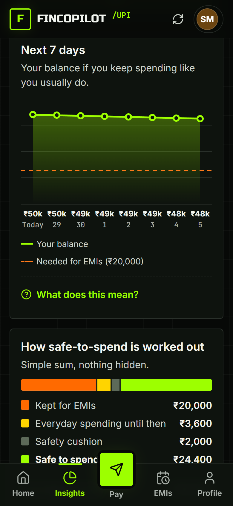
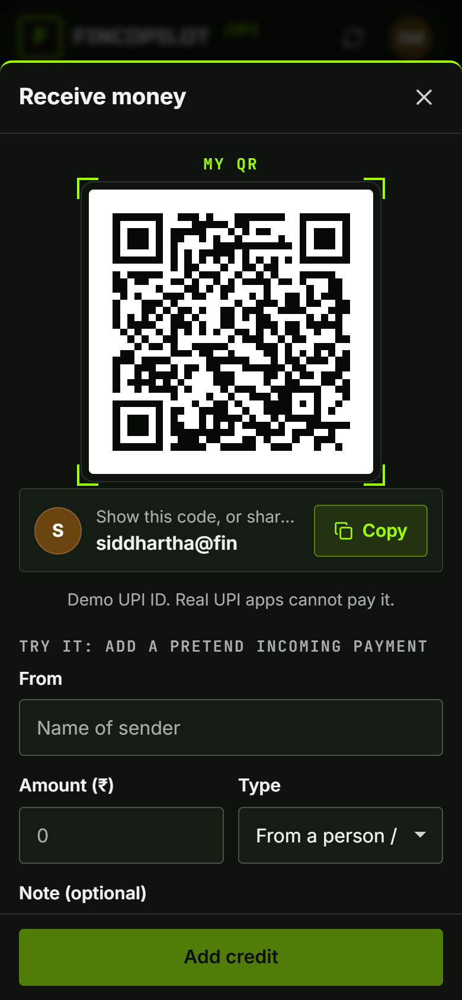
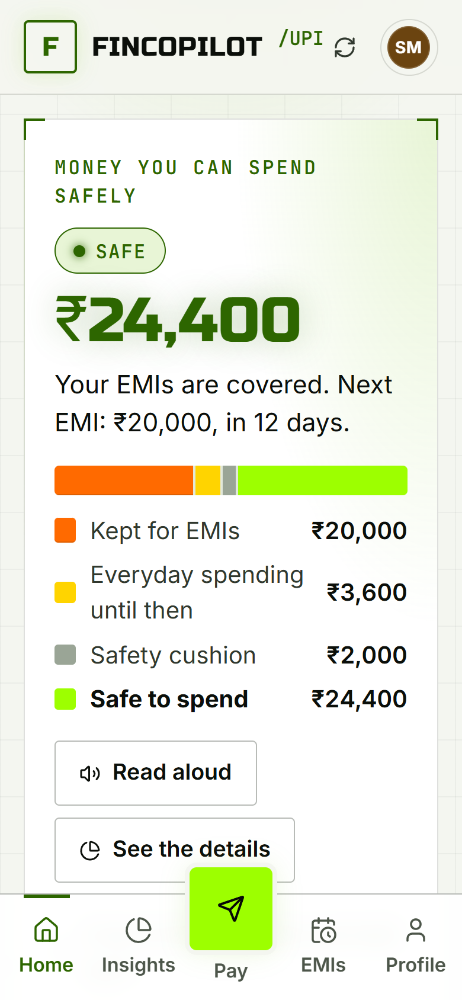

# FinCopilot

**UPI payments that tell you how much is safe to spend before your EMIs are due.**

FinCopilot is a demo payments app for Indian UPI users. It works like a regular UPI app: pay to a mobile number or UPI ID, check your balance with a UPI PIN, receive money with your QR code, and see your history. It adds one thing most payment apps don't: **before you pay, it checks whether the payment would leave you short for an upcoming loan EMI**, and asks you to confirm if it would.

It is built to be easy for everyone, from a first-time smartphone user of 60 to a student of 20: one big number on the home screen, plain words instead of banking jargon, a text-size setting, a light and a dark theme, and a "Read aloud" button.

> **Everything is pretend.** Accounts, banks and payments are fake and no real money moves. Demo UPI PIN: `1234`.

- **Live app:** https://fincopilot-upi.vercel.app
- **API health check:** https://fincopilot-upi.vercel.app/api/health

| Home | Pay screen: new payee + EMI warning | UPI PIN |
|---|---|---|
|  |  |  |

| Insights | My QR | Light theme, extra-large text |
|---|---|---|
|  |  |  |


---

## Contents

1. [How it works](#how-it-works)
2. [Features](#features)
3. [Design](#design)
4. [What changed in this update](#what-changed-in-this-update)
5. [Tech stack](#tech-stack)
6. [Project structure](#project-structure)
7. [Run it locally](#run-it-locally)
8. [Browser-only demo](#browser-only-demo)
9. [Tests](#tests)
10. [Configuration](#configuration)
11. [Deployment](#deployment)
12. [API reference](#api-reference)
13. [Contributing](#contributing)
14. [Documentation](#documentation)

---

## How it works

FinCopilot works out one number: **money you can spend safely**.

```
safe to spend = current balance
              − EMIs still to pay this month
              − usual daily spending × days until the next EMI
              − ₹2,000 safety cushion
```

- **Usual daily spending** is everything you spent in the **last 30 days** except rent and EMIs, divided by 30, with a minimum of ₹300 a day.
- **Status** is one of three levels:
  - **Safe:** the balance covers EMIs, usual spending and the cushion.
  - **Be careful:** EMIs and spending are covered, but not the cushion, or an EMI is late.
  - **At risk:** the balance won't cover EMIs plus usual spending. The app shows how much you'd be short.
- **Late EMIs:** if an EMI's due date passes without a payment, it is marked **Overdue**, counted as due now, and shown at the top of the home screen.

The formula is fixed and explainable, not a trained model. The home screen shows the split as one coloured bar, the **Insights** screen shows the sum line by line, and **Can I afford it?** shows what any amount would do before you pay. The engine lives in [`backend/src/services/financialEngine.js`](backend/src/services/financialEngine.js).

## Features

| Area | What you can do |
|---|---|
| **Home** | One big "money you can spend safely" figure, a bar showing where your balance goes, a plain sentence about your EMIs, big buttons for common tasks, and banners for late or soon-due EMIs. |
| **Getting-started tips** | First-time users see three short steps. They can be hidden, and shown again from Profile. |
| **Read aloud** | Reads the summary and advice with the phone's own voice, in Indian English. |
| **Pay** | Pay to a 10-digit mobile number, a UPI ID or a saved contact. Payments are capped at ₹1,00,000 (the NPCI limit for person-to-person UPI). |
| **Scam protection** | Paying someone who isn't in your contacts shows "First time paying… check the name". The PIN screen reminds you never to share your PIN. |
| **EMI protection** | While you type an amount, the pay screen says whether it's safe or how much you'd be short for which EMI. A risky payment needs a tick in "I understand" before you can continue. |
| **UPI PIN** | Every payment, **including EMI payments**, needs the PIN, as do balance checks and PIN changes. 3 wrong attempts lock it for 5 minutes. |
| **My QR** | Your UPI QR code (a standard `upi://pay` link) and UPI ID, ready to show or copy. |
| **EMIs** | Add, pay and remove EMIs. Countdown, "Overdue" state, months left and % repaid. |
| **Insights** | Where you stand, a 7-day balance chart with the "needed for EMIs" line, a calendar of money in and out, spending by category (donut), the safe-to-spend sum, **Can I afford it?**, and a 30/60/90-day outlook that shows shortfalls. |
| **History** | Search, filter, change a category, and download a CSV statement. |
| **Profile & settings** | Text size (Normal / Large / Extra large), Dark or Light colours, switch demo account, change UPI PIN (current PIN checked first), reset demo data. |
| **Install** | A web app manifest, so it can be added to the phone's home screen. |
| **Links** | Each tab has its own address (`#insights`, `#emis`…), so the Back button works. |

## Design

The look follows the **Doomsday Hackathon** site ([doomsday-acm.vercel.app](https://doomsday-acm.vercel.app/)): a near-black background with a faint grid, a toxic-lime accent (`#9DFF00`), hazard orange (`#FF6A00`) and warning yellow (`#FFD400`), corner-bracket frames, **Russo One** for big numbers, **Inter** for text and **JetBrains Mono** for small labels.

The theme is tuned for reading, not just for looks:

- Every size is in `rem`, so the **Text size** setting (and the browser's own text size) scales the whole app. Body text is 16 px at normal size.
- Every text colour meets WCAG AA contrast (at least 4.5:1) in both themes; most are above 7:1.
- Tap targets are at least 44 px. Colour is never the only signal: statuses also have words, and charts have labels.
- Charts draw shapes in SVG but put every number in HTML, so labels stay readable at any size, and each chart has a screen-reader table.
- Colour tokens live at the top of [`frontend/src/styles/index.css`](frontend/src/styles/index.css), with a `[data-theme='light']` set.

## What changed in this update

A second full audit and a redesign. The complete list, with evidence, is in [AUDIT_REPORT.md](AUDIT_REPORT.md); the research behind the new features is in [UPGRADES.md](UPGRADES.md).

### Fixed

| Before | After |
|---|---|
| **EMI payments moved money without a UPI PIN** | EMI payments need the PIN, with the same lockout |
| Anyone could change another user's transaction category | Only the owner can |
| The new PIN could be the same as the old one; a wrong current PIN was only reported after typing all three PINs | Rejected; the current PIN is checked first |
| Daily spending used the last 100 payments whatever their dates | Only the last 30 days count |
| The 30/60/90-day outlook showed ₹0 instead of a shortfall | Shows "Short ₹X" in red |
| A missed EMI silently rolled over to "Due in 29 days" | Marked **Overdue** and flagged on Home |
| An EMI due on the 31st was never taken off in 30-day months in the 7-day chart | Month-end due days are handled |
| The dev server restarted on every payment (`nodemon` watched the data file) | Data and backup folders are ignored |
| A half-written `db.json` was silently replaced by an empty store | Writes are atomic; an unreadable file is kept aside |
| No security headers; CORS open to every site | Standard headers; optional `CORS_ORIGIN` allow-list |
| Unlimited name lengths, free-text enums, formula injection in the CSV statement | Inputs capped and checked; CSV cells neutralised |
| Vite dev-server advisory (`npm audit`: 2) | Vite 8, 0 advisories |
| `npm run build:demo` failed on Windows | Fixed |

### Added

- The Doomsday theme with a Light option, text-size setting, getting-started tips, Read aloud, help panels ("How is this number worked out?").
- Money-split bar, 7-day area chart, category donut, money calendar.
- New-payee warning, risky-payment confirmation, PIN safety note, Overdue EMIs.
- My QR, web app manifest, URL per tab.
- `POST /api/account/verify-pin`.
- 13 new tests (26 in total), including date-based engine tests, and a GitHub Actions workflow.

## Tech stack

| Part | Technology |
|---|---|
| Frontend | React 18, Vite 8, Axios, Lucide icons, `qrcode`, plain CSS (design tokens in `styles/index.css`) |
| Backend | Node.js, Express 4, Mongoose 8 |
| Storage | MongoDB (when `MONGODB_URI` is set) or a JSON file (`backend/data/db.json`) |
| Tests | `node:test` (API and engine), run in GitHub Actions |
| Hosting | Vercel (`vercel.json`: `/api/*` → backend, everything else → frontend) |

## Project structure

```
AI-Financial-Copilot/
├── backend/
│   ├── src/
│   │   ├── server.js                Express app, security headers, routes, DB connection middleware
│   │   ├── config/                  db.js (MongoDB), store.js (JSON file store), categories.js
│   │   ├── controllers/             account, transaction and EMI request handlers
│   │   ├── services/
│   │   │   ├── dataService.js       storage layer + UPI PIN checks + transfers
│   │   │   ├── financialEngine.js   safe-to-spend, risk status, overdue EMIs, forecasts
│   │   │   ├── seedData.js          demo accounts (shared with the browser demo)
│   │   │   └── seedService.js       loads the demo data
│   │   ├── models/                  Mongoose schemas
│   │   ├── routes/                  /api/account, /api/transactions, /api/emi
│   │   └── scripts/exportBackup.js  JSON backup export
│   ├── tests/                       api.test.js (HTTP), engine.test.js (dates and maths)
│   └── nodemon.json                 dev watcher settings
├── frontend/
│   ├── public/                      web app manifest and icon
│   ├── src/
│   │   ├── App.jsx                  app shell: top bar, sidebar / bottom nav, sheets, URL per tab
│   │   ├── pages/                   Home, Insights, EMIs, History, Profile
│   │   ├── flows/                   Pay, check balance, change PIN, receive (My QR), EMI, transaction sheets
│   │   ├── components/              TransactionRow, charts/ (projection, donut, calendar), ui/ (Sheet, PinPad, MoneySplit, Help, ...)
│   │   ├── lib/                     formatting, "Can I afford it?" simulator, display settings, read aloud
│   │   ├── services/                api.js (HTTP client), browserApi.js (in-page API for the demo)
│   │   └── styles/index.css         design system (dark + light themes)
│   └── scripts/                     build-demo.mjs, serve-browser-api.mjs
├── .github/workflows/ci.yml         tests and builds on every push and pull request
├── api/index.js                     serverless entry wrapping the Express app
├── docs/                            screenshots, backup and recovery guide
├── AUDIT_REPORT.md
├── UPGRADES.md
├── CONTRIBUTING.md
└── vercel.json
```

## Run it locally

You need **Node.js 20.19+ or 22.12+** (Vite 8 requirement; tested on 22).

```bash
git clone https://github.com/Jaya-Siddhartha/AI-Financial-Copilot.git
cd AI-Financial-Copilot

npm install                          # root (runs backend + frontend together)
cd backend && npm install && cd ..
cd frontend && npm install && cd ..

npm run dev
```

- App: http://localhost:5173
- API: http://localhost:5000/api/health

The backend creates the two demo accounts on first start. Use PIN `1234`. To start over, use **Profile → Reset demo data**.

## Browser-only demo

The whole app can also run as one HTML page with no server, which is handy for sharing a clickable demo.

```bash
cd frontend
npm run build:demo        # → frontend/dist-demo/fincopilot-demo.html
```

API calls are answered inside the page by `src/services/browserApi.js`. It reuses the backend's engine, categories and seed data, so every number matches the real server. Data is saved in the browser's localStorage, and the demo shows placeholder bank names.

To confirm the in-page API behaves exactly like the server, run the API tests against it:

```bash
cd frontend && node scripts/serve-browser-api.mjs 5055 &
cd ../backend && API_URL=http://127.0.0.1:5055/api node --test tests/api.test.js
```

## Tests

```bash
cd backend && npm test        # 26 tests: 18 API tests + 8 engine tests
cd frontend && npm run build  # production build must succeed
```

- **API tests** cover the full demo scenario (both accounts, transfers, balance check, EMIs, risk levels, reset), PIN required for payments and EMIs, PIN lockout and reset, verifying and changing the PIN, amount limits, EMI ownership and validation, category whitelist and ownership, input limits, recipient matching, the rent-based forecast, security headers, and that "Can I afford it?" predicts the dashboard after a real payment.
- **Engine tests** fix the date and check month-end due days, overdue EMIs, early payments, new EMIs, the 30-day spending window, the 7-day chart and negative outlooks.

GitHub Actions runs all of these, both builds, and the API tests against the in-browser API on every push and pull request.

## Configuration

Copy `.env.example` to `backend/.env` for backend settings. `VITE_API_BASE_URL` goes in `frontend/.env`.

| Variable | Default | Purpose |
|---|---|---|
| `PORT` | `5000` | Backend port |
| `MONGODB_URI` | empty | MongoDB connection string. Without it, data is stored in `backend/data/db.json` |
| `CORS_ORIGIN` | empty (any origin) | Comma-separated list of sites allowed to call the API from a browser |
| `VITE_API_BASE_URL` | `/api` | API base URL for the frontend, if hosted separately |
| `FINCOPILOT_DATA_DIR` | `backend/data` | Where the JSON store keeps `db.json` (used by the tests) |

## Deployment

The repo deploys to Vercel as-is with `vercel.json`.

- If the Vercel project is connected to GitHub, pushing a branch creates a preview deployment and merging to `main` updates production.
- Manual deploy: `npm i -g vercel && vercel --prod` from the repo root.
- **Set `MONGODB_URI` in Vercel.** Without it, data is kept per server instance in `/tmp`, so balances can differ between requests and reset on cold start.

After deploying, check that `/api/health` returns `online` and that a ₹1 payment with PIN `1234` succeeds.

## API reference

All routes are under `/api`. Responses are JSON with `success` and either `data` or `message`.

| Method | Path | Body / query | Purpose |
|---|---|---|---|
| GET | `/health` | | Health check |
| GET | `/account/all` | | Demo accounts for the switcher |
| GET | `/account/dashboard` | `?userId=` | Balances, safe-to-spend, status, EMIs, insights, recent transactions |
| POST | `/account/check-balance` | `{ userId, upiPin }` | Check balance with PIN |
| POST | `/account/verify-pin` | `{ userId, upiPin }` | Check the current PIN (first step of changing it) |
| POST | `/account/update-pin` | `{ userId, oldPin, newPin }` | Change UPI PIN (new PIN must differ) |
| POST | `/account/reset` | | Restore demo data |
| GET | `/transactions` | `?userId=&type=&category=&search=&limit=` | History |
| POST | `/transactions/payment` | `{ senderId, recipientPhone \| recipientUpi \| recipientName, amount, upiPin, note }` | Pay |
| POST | `/transactions/receive` | `{ userId, senderName, amount, category, note }` | Simulate an incoming payment |
| PATCH | `/transactions/:id/category` | `{ userId, category }` | Change a transaction's category (owner only) |
| GET | `/emi` | `?userId=` | List EMIs (status: `upcoming`, `overdue`, `paid_this_cycle`, `closed`) |
| POST | `/emi` | `{ userId, name, lender, amount, dueDay, remainingInstallments }` | Add an EMI |
| POST | `/emi/:id/pay` | `{ userId, upiPin }` | Pay an EMI |
| DELETE | `/emi/:id` | `?userId=` | Remove an EMI |

Error codes: `400` invalid input or wrong PIN, `403` no PIN set, `404` not found, `423` PIN locked, `500` server error.

## Contributing

Contributions are welcome. See [CONTRIBUTING.md](CONTRIBUTING.md) for setup, branch naming, code style and the checks to run before opening a pull request. Good first issues are listed in [UPGRADES.md](UPGRADES.md).

## Documentation

| File | What's in it |
|---|---|
| [AUDIT_REPORT.md](AUDIT_REPORT.md) | Full audit: every issue found, evidence, fix status, verification |
| [UPGRADES.md](UPGRADES.md) | Research on 2026 UPI and money apps, what was built from it, and the roadmap |
| [CONTRIBUTING.md](CONTRIBUTING.md) | How to contribute |
| [docs/DATABASE_BACKUP_AND_RECOVERY.md](docs/DATABASE_BACKUP_AND_RECOVERY.md) | Backups (`cd backend && npm run backup`) and recovery |
